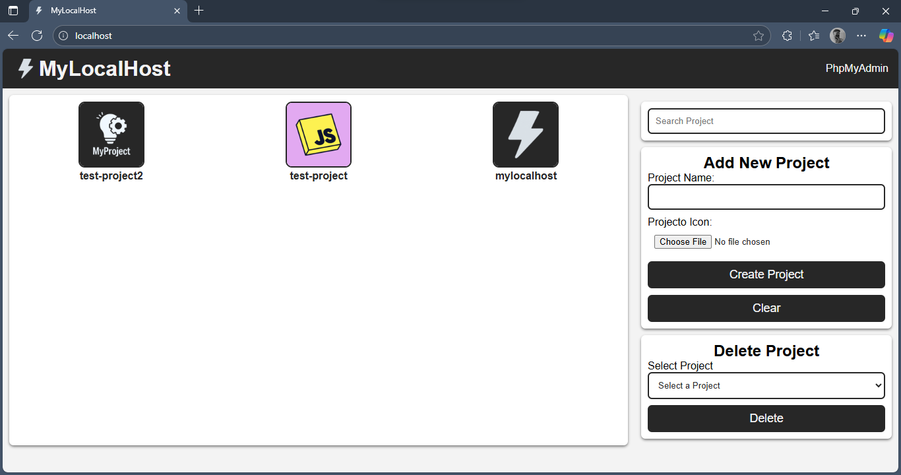
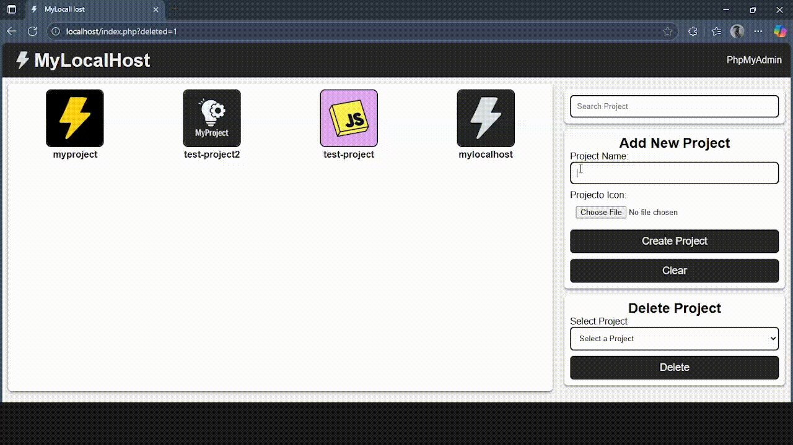
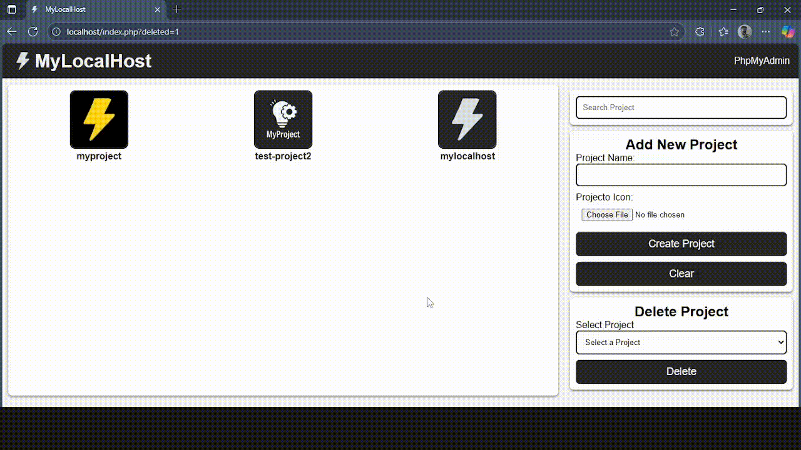

# 📘 MyLocalHost

Aplicación sencilla para gestionar y acceder a tus proyectos locales desde una interfaz web moderna.  

---

## ⚡ Características

- Visualización de proyectos con íconos personalizados.  
- Búsqueda en tiempo real con AJAX.  
- Creación automática de carpetas para proyectos.  
- Subida de íconos (con fallback a un ícono por defecto).  
- Eliminación de proyectos con confirmación (se eliminan la carpeta y el ícono asociados).  
- Interfaz responsiva y limpia.  

---

## 🛠️ Requisitos

- PHP 7.4 o superior  
- Servidor local (Laragon, XAMPP, WAMP, etc.)  
- MySQL/MariaDB  
- Extensión PHP GD (para manejar imágenes)  

---

## 📂 Instalación

1. Clona o descarga el repositorio en la carpeta raíz de tu servidor local.  

   ```bash
   git clone https://github.com/MiguelPaez782/mylocalhost.git
   ```

   O bien, descarga el `.zip` y extrae la carpeta en:  
   - **Laragon:** `C:\laragon\www`  
   - **XAMPP:** `C:\xampp\htdocs`  

2. Crea la base de datos ejecutando el siguiente script en **phpMyAdmin** o consola MySQL:  

   ```sql
   CREATE DATABASE IF NOT EXISTS mylocalhostapp;

   USE mylocalhostapp;

   CREATE TABLE IF NOT EXISTS projects_address (
       id INT AUTO_INCREMENT PRIMARY KEY,
       project_name VARCHAR(100) NOT NULL,
       project_path VARCHAR(255) NOT NULL,
       project_icon VARCHAR(255) NOT NULL,
       created_at TIMESTAMP DEFAULT CURRENT_TIMESTAMP
   );
   ```

3. Configura la conexión en `config.php`:  

   ```php
   $baseUrl = "http://localhost/";
   $phpMyAdminUrl = $baseUrl . "phpmyadmin/";
   $host = "localhost";
   $dbname = "mylocalhostapp";
   $username = "root";
   $password = "";
   ```

   > ⚠️ Ajusta `$username` y `$password` según tu entorno.

4. Asegúrate de que la carpeta `projects/` tenga permisos de escritura.  

---

## ▶️ Uso

1. Inicia tu servidor local.  
2. Accede a la aplicación en el navegador:  

   ```
   http://localhost/
   ```

3. **Funciones disponibles:**  
   - **Buscar proyectos:** Escribe en el campo de búsqueda y verás resultados en tiempo real.  
   - **Agregar proyecto:** Completa el formulario, sube un ícono opcional y el sistema creará la carpeta en `/projects/`.  
   - **Eliminar proyecto:** Selecciona el proyecto en la lista y confirma la eliminación.  

---

## 📸 Capturas de pantalla

1. **Vista principal**
  
   
 

2. **Agregar proyecto**
 
   
   

3. **Búsqueda en tiempo real** 
   
   


4. **Eliminar proyecto**  
 
   


---

## 📦 Estructura del proyecto

```
mylocalhostapp/
│── index.php
│── config.php
│── add_project.php
│── delete_project.php
│── get_projects.php
│
├── assets/
│   ├── css/
│   │   ├── style.css
│   │   └── delete_style.css
│   ├── js/
│   │   ├── search_ajax.js
│   │   └── jquery-3.7.1.min.js
│   └── img/
│       ├── icon-app.png
│       └── projects-icons/
|           └── default.png
│  
└── projects/   
```

---

## ✨ Autor

Creado por **Miguel Páez**
🔗 [GitHub](https://github.com/MiguelPaez782)

Siéntete libre de contribuir o modificarlo para tu uso personal.
