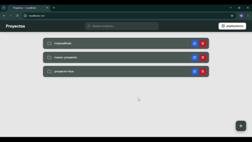
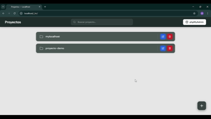
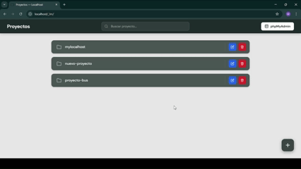

# 🗂️ MyLocalHost - V2

Interfaz visual para gestionar tus proyectos locales desde el navegador.  
Reemplaza el aburrido "Index of /" de Apache con un panel moderno y funcional.

---

## 📁 Estructura del proyecto

```
_lm/
├── index.php                  ← Página principal
├── api/
│   └── projects.php           ← API REST (crear, renombrar, eliminar)
├── assets/
│   ├── app.js                 ← Lógica JavaScript (vanilla)
│   └── icons/
│       └── Icons.php          ← Librería de iconos SVG
├── components/
│   ├── Topbar.php             ← Barra de navegación superior
│   ├── ProjectCard.php        ← Tarjeta de proyecto
│   ├── Modals.php             ← Modales (editar / eliminar)
│   ├── Fab.php                ← Botón flotante + formulario
│   └── Notifications.php      ← Contenedor de notificaciones
└── styles/
    ├── variables.css          ← ⚙️  Tokens de diseño (personalizable)
    ├── base.css               ← Reset y estilos globales
    └── main.css               ← Estilos de la aplicación
```

---

## 🚀 Instalación

### Paso 1 — Copiar la carpeta `_lm`

Copia la carpeta completa `_lm/` dentro de tu directorio raíz de Apache:

| Servidor | Directorio raíz |
|----------|----------------|
| XAMPP (Windows) | `C:\xampp\htdocs\` |
| XAMPP (Mac/Linux) | `/Applications/XAMPP/htdocs/` |
| WAMP | `C:\wamp64\www\` |
| Laragon | `C:\laragon\www\` |
| LAMP | `/var/www/html/` |

### Paso 2 — Reemplazar el `index.php` raíz

Copia el siguiente codigo en tu `index.php` raíz.

```php
// Redirect to the manager UI
header('Location: /_lm/', true, 302);
exit;
```

> ⚠️ Si ya tienes un `index.php` en la raíz, haz una copia de seguridad primero.

```
htdocs/
├── index.php          ← (era root-index.php)
└── _lm/               ← carpeta del manager
```

### Paso 3 — Configurar `.htaccess` (recomendado)

Crea el archivo `.htaccess` en tu directorio raíz y con el siguiente código:

```
# ======================================================
# MyLocalHost — Apache .htaccess (for www/ or htdocs/)
# ======================================================

Options -Indexes
Options -MultiViews

# ─── Rewrite Engine ──────────────────────────────────────────

RewriteEngine On

# If the request is for an existing file or directory, serve it directly
RewriteCond %{REQUEST_FILENAME} -f [OR]
RewriteCond %{REQUEST_FILENAME} -d
RewriteRule ^ - [L]

# Route root requests to the manager
RewriteRule ^$ /_lm/ [L,R=302]

# ─── Security Headers ────────────────────────────────────────

<IfModule mod_headers.c>
  Header always set X-Frame-Options "SAMEORIGIN"
  Header always set X-Content-Type-Options "nosniff"
  Header always set Referrer-Policy "strict-origin-when-cross-origin"
</IfModule>

# ─── Deny direct access to _lm internals (PHP source) ────────

<FilesMatch "\.(php)$">
  <If "%{REQUEST_URI} =~ m|^/_lm/components/|">
    Require all denied
  </If>
  <If "%{REQUEST_URI} =~ m|^/_lm/assets/icons/|">
    Require all denied
  </If>
</FilesMatch>

# ─── Charset & MIME ──────────────────────────────────────────

AddDefaultCharset UTF-8
```

> ⚠️ Si ya tienes un `.htaccess` en la raíz, haz una copia de seguridad primero.

```
htdocs/
├── .htaccess          ← (era root-htaccess.txt)
├── index.php
└── _lm/
```

Asegúrate de tener `mod_rewrite` habilitado en Apache.

### Paso 4 — Verificar permisos

PHP necesita permisos de **lectura/escritura** en el directorio raíz para crear y renombrar carpetas:

```bash
# En Linux/Mac (ajusta la ruta según tu servidor):
chmod 755 /var/www/html/
```

---

## ▶️ Uso

1. Inicia tu servidor local.  
2. Accede a la aplicación en el navegador:  

   ```
   http://localhost/
   ```

3. **Funciones disponibles:**  
   - **Buscar proyectos:** Escribe en el campo de búsqueda y verás resultados en tiempo real.  
   - **Agregar proyecto:** Haz click en el botón + que está en la parte inferior derecha, dale un nombre al proyecto y guardalo.
   - **Editar proyecto:** Escoge un proyecto y dale click en el botón azul y se abrírá una ventana donde le puedes cambiar el nombre.
   - **Eliminar proyecto:** Escoge el proyecto en la lista y dale click en el botón rojo y confirma la eliminación.  

---

## 📸 Capturas de pantalla

1. **Buscar proyecto**
  
   
 

2. **Agregar proyecto**
 
   
   

3. **Editar proyecto** 
   
   


4. **Eliminar proyecto**  
 
   


---

## ⚙️ Personalización

Edita `_lm/styles/variables.css` para cambiar colores, fuentes, tamaños y más.  
Todas las variables están documentadas en ese archivo con comentarios explicativos.

### Variables más comunes:

```css
--color-topbar:      #1f2d2b;   /* Color del topbar */
--color-card:        #4a5654;   /* Color de las tarjetas */
--color-primary:     #2563eb;   /* Botón editar */
--color-danger:      #dc2626;   /* Botón eliminar */
--font-body:         'DM Sans'; /* Fuente principal */
--content-max-width: 900px;     /* Ancho máximo del contenido */
```

---

## 🔒 Seguridad

- Este manager está diseñado para uso **local** únicamente.
- El `.htaccess` bloquea el acceso directo a los archivos PHP de componentes.
- Los nombres de proyecto son validados en el servidor (solo caracteres seguros).
- Las carpetas del sistema (`phpmyadmin`, `.git`, etc.) están ignoradas automáticamente.

---

## 🗂️ Carpetas ignoradas por defecto

Las siguientes carpetas nunca aparecerán como proyectos:
`_lm`, `phpmyadmin`, `phpMyAdmin`, `.git`, `.svn`, `node_modules`, `vendor`

Para agregar más carpetas a ignorar, edita el array `IGNORED_DIRS` en:  
`_lm/api/projects.php`


---

## ✨ Autor

Creado por **Miguel Páez**
🔗 [GitHub](https://github.com/MiguelPaez782)

Siéntete libre de contribuir o modificarlo para tu uso personal.